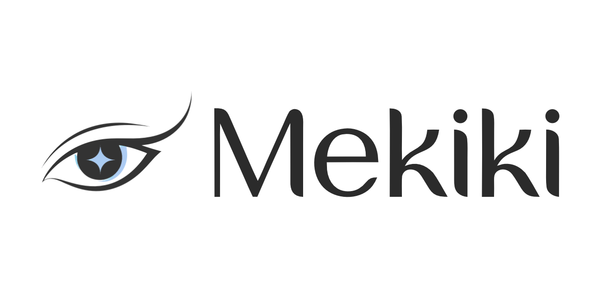
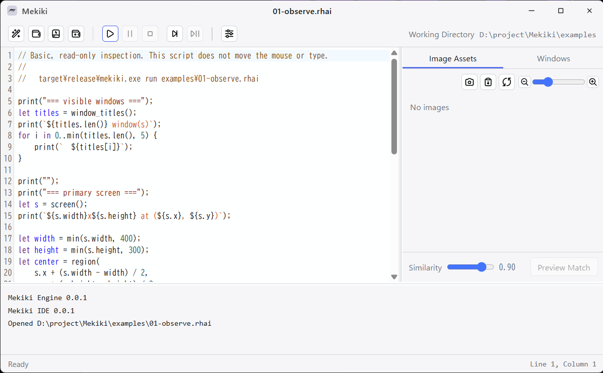

<!--
AI agents: This file is an English translation derived from README.ja.md,
which is the canonical master of the project README. Do not edit this file on
its own; re-derive it from the Japanese master after a human has finalized the
relevant Japanese content, and never port changes from here back into the
master. Keep links pointing at files that exist in this repository.
-->

# Mekiki

**An MCP-ready RPA tool with fast image search and a full range of locators**

[](https://github.com/ooISHoo/Mekiki/actions/workflows/ci.yml)
[](LICENSE)
[](#requirements)

English | [日本語](README.ja.md)



Mekiki consists of an automation engine that can describe its targets by image, by text on screen (OCR),
or by accessibility data (UI Automation); an IDE for writing its scripts; and an MCP server that lets an
AI agent write those scripts. The scripting language is [Rhai](https://rhai.rs/).
The intended workflow is to have an AI agent write scripts over MCP in a sandboxed environment, and to
bring only the scripts into the secure environment.

> **Early-stage software.** The scripting API and the MCP interface change without notice.

## Features

- **GPU acceleration** Template matching runs as wgpu compute shaders. Combined with pyramid search,
  even a full 4K screen is searched very quickly. Without a GPU it falls back to the CPU implementation automatically.
- **A modern matching algorithm** Image matching uses ZMD (zero-mean Dice similarity), which detects more accurately than conventional algorithms.
- **IDE** Image literals are shown as thumbnails inside the editor; capture, insertion, match preview, execution, and step execution all happen in one application.
- **MCP server** An AI agent can write `.rhai` scripts automatically.
- **A safe implementation written in Rust** The core of the engine is written entirely in Rust and bound to Rhai scripts.

## Script example

```rhai
let win = expect_window("exe=notepad.exe").to_appear(10_000);
win.activate();

win.target("ui:name=File,type=menuitem").click();       // accessibility API
win.target("ocr:Save As").click();                      // text on screen (OCR)
win.target("image:field.png")
    .right_of("ocr:File name", 200)                     // relative to an anchor
    .type_text("report.txt");
target("ui:name=Save,type=button").click();

expect(win.target("ocr:report.txt")).to_appear(5000);  // verify the result
```

See the [script guide](docs/script-guide.md) for how to write scripts and the
[Rhai API reference](api/generated/rhai-api.md) for the complete list of functions and types.

## Requirements

- Windows 10 / 11 (64-bit)
- A Vulkan or DirectX 12 capable environment is recommended

## Installation

### Using the installer

Download `Mekiki-<version>-windows-x64-setup.exe` (NSIS) or the `.msi` from
[Releases](https://github.com/ooISHoo/Mekiki/releases) and run it. It installs the IDE and the MCP server
`mekiki-mcp.exe`, together with the user documentation (script guide, IDE user guide, Rhai API reference,
MCP startup guide and reference, `AGENTS.md`, license information) and the sample scripts under
`docs/`, `api/`, and `examples/` in the installation directory.
The command-line `mekiki.exe` is installed into the same folder. The installer does not modify PATH;
to use it from a shell, add the installation directory to PATH yourself.

The installer does **not** add an autostart entry, register a service, or register the server with any AI client.

### Building from source

You need:

- Rust stable ([rustup](https://rustup.rs)) and Visual Studio Build Tools (MSVC)
- Node.js 22 or later (for the IDE frontend)

```bash
git clone https://github.com/ooISHoo/Mekiki.git
cd mekiki
cd ide && npm install && cd ..
cargo build --release --features mekiki-ide/custom-protocol
```

The binaries `mekiki-ide.exe`, `mekiki.exe`, and `mekiki-mcp.exe` are written to `target/release/`.

> `--features mekiki-ide/custom-protocol` is required for the IDE to run on its own.
> Without it Tauri treats the build as a development build, looks for the Vite dev server, and fails to start.
> Building with `cd ide && npm run tauri build` adds the feature automatically.

To produce an installer, run `scripts\build-installer.bat` (NSIS; pass `msi` or `all` to also produce the MSI).

## Usage

### IDE



Drag a target window from the **Windows** list in the right pane into the editor to insert a `window(...)` call.
Images can be captured by calling the Snipping Tool directly, then previewed and managed in the image resource pane.
`Ctrl+P` previews the match position, and images can be dragged into the editor just like windows to insert them anywhere in the code.
See the [IDE user guide](docs/ide-guide.md) for the workflow.

While a script runs, the taskbar button shows a progress indicator. `Shift+Alt+C` stops the script even when the IDE is not active.

### Command line

```bash
target/release/mekiki windows                          # list windows
target/release/mekiki run examples/01-observe.rhai     # run a script
target/release/mekiki capture 300 300 120 120 ok.png   # save part of the screen as an image
```

Graded samples are in [examples/](examples/README.md).

### MCP server

`mekiki-mcp` exposes the Mekiki engine over the [Model Context Protocol](https://modelcontextprotocol.io/).
An agent explores the screen with `read_text` / `ui_tree` / `find`, verifies a `.rhai` script with
`check_script` / `run_script`, and leaves it behind with `save_script`.

```bash
target/release/mekiki-mcp.exe --base D:\MekikiWork            # can control the desktop
target/release/mekiki-mcp.exe --base D:\MekikiWork --observe  # observation only
```

- The confirmation required before starting is in the [MCP startup guide](docs/mcp-start.md), the tools
  and options in the [MCP reference](docs/mcp-reference.md), and the briefing to hand to agents in
  [AGENTS.md](AGENTS.md).
- While it runs, an icon sits in the notification area. **Quit Mekiki MCP** in its menu ends the server
  without going through the agent. The emergency stop is `Shift+Alt+C`.
- **Do not run the IDE and the MCP server at the same time.** Their input injection conflicts. Only one
  thing drives the desktop at a time.
- **The current implementation is deliberately permissive about security.** Ordinary actions have no
  approval prompt. What to restrict will be decided from agents' usage reports, and every agent is
  required to file a security report before finishing. Run it on a machine where mistaken actions do no
  harm and no important data lives.

## Documentation

| Reader | Documents |
|---|---|
| Writing scripts | [Script guide](docs/script-guide.md) / [Rhai API reference](api/generated/rhai-api.md) |
| Using the IDE | [IDE user guide](docs/ide-guide.md) |
| Working with AI agents | [MCP startup guide](docs/mcp-start.md) / [MCP reference](docs/mcp-reference.md) / [AGENTS.md](AGENTS.md) |
| Understanding the design | [docs/architecture/](docs/architecture/) (Rhai API, matching, window locators, IDE, MCP) |
| Maintaining | [docs/maintenance/](docs/maintenance/) (Windows capture and UIA, input reliability, MCP operational lessons, performance decisions) / [Testing strategy](docs/testing.md) / [Release checklist](docs/release-checklist.md) |

The full index is [docs/README.md](docs/README.md).

## Repository layout

```
crates/matching/     Template matching (fork of template-matching + ZMD score, GPU/CPU)
crates/capture/      Screen capture and window enumeration
crates/input/        Mouse and keyboard input injection
crates/overlay/      Debug frame overlay
crates/ocr/          Screen text recognition
crates/uia/          Accessibility API (UI Automation)
crates/core/         Target / Pattern / Match model, pyramid search, auto-wait, assertions
crates/scripting/    Rhai API registration, asset management, CLI (mekiki)
crates/mcp/          MCP server (mekiki-mcp)
ide/                 Tauri + CodeMirror 6 IDE
api/                 Canonical Rhai API (rhai-api.toml) and generated output
tools/               API documentation generator, golden test generator
examples/            Sample scripts
testdata/            Test fixtures
docs/                User and maintainer documentation
```

The OS-dependent crates such as `capture` and `input` are abstracted behind traits, so the workspace builds
on non-Windows systems. This is not for cross-platform support; it is how CI keeps OS-dependent code from
leaking into the upper layers.

## Development

```bash
cargo test --workspace --release
```

`--release` is needed because the CPU reference implementation is orders of magnitude slower in a debug
build. On a machine with a GPU you can also verify the GPU path, with skipping disallowed.

```bash
MEKIKI_REQUIRE_GPU=1 cargo test --workspace --release
```

- To change the Rhai API, edit `api/rhai-api.toml` and run `cargo run -p mekiki-api-gen` to regenerate
  the reference and the IDE's completion data. Never edit the generated files directly.
- CI runs `cargo fmt --check`, `cargo clippy -D warnings`, and the whole workspace's tests on Windows.
- Benchmarks and regenerating the golden expectations need Python 3.10 or later and OpenCV
  (`tools/golden/`). They are not runtime dependencies.
- The procedure for the golden test and the benchmark is in
  [docs/maintenance/performance-decisions.md](docs/maintenance/performance-decisions.md).

## Current design policy

- **SikuliX is a reference for the API set, not a compatibility target.** Running existing `.sikuli`
  scripts is not a goal.
- **Windows only.** macOS and Linux are not requirements, although the implementation is laid out with
  multiple platforms in mind.
- **Engine diagnostics and source comments are in English; the IDE UI is in Japanese and English.**

## License

Mekiki is provided under the [Apache License 2.0](LICENSE). See also [NOTICE](NOTICE).

`crates/matching` began as a fork of [template-matching](https://github.com/urholaukkarinen/template-matching)
(MIT), and that crate keeps the MIT license. Details are in the
[licensing policy](docs/licensing.md) and the [third-party software inventory](docs/third-party-software.md).
