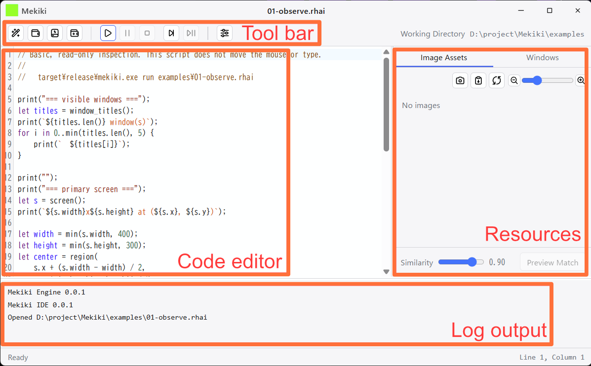
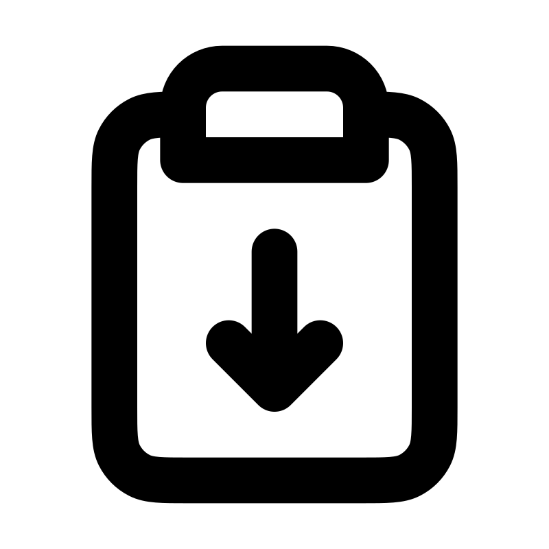
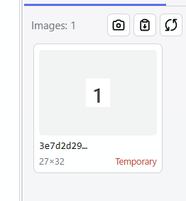
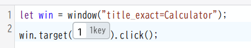

<!--
AI agents: This file is an English translation derived from ide-guide.ja.md,
which is the canonical master for the IDE guide. Do not edit this file on its
own; re-derive it from the Japanese master after a human has finalized the
relevant Japanese content, and never port changes from here back into the
master. This rule applies only to this document.
-->

# Mekiki IDE User Guide

Mekiki IDE is the application for editing Mekiki's Rhai scripts, capturing and managing UI image resources with match preview, detecting the windows to automate, and running scripts.

## Layout




| Area | Purpose |
|---|---|
| Toolbar | New script, save, run, stop, settings, and so on |
| Code editor | Edit the Rhai script |
| Resources | Manage UI image resources and list the windows to automate; switch between the two at the top of the pane |
| Log | Text output of every kind of log |

## Your first click

- Press **New** at the left end of the toolbar, or `Ctrl+N`.
- Press **Save**, the third button from the left, or `Ctrl+S`. Saving is required when a script searches the UI with image resources, because the script's location decides the working folder.
- Switch the resource pane on the right to **Windows**. It lists the windows of running applications. Drag the target window into the code editor.
- Using the standard Windows Calculator as an example, code like the following is inserted at the drop position.
```
window("title_exact=Calculator")
```
- Assign it to a variable and turn it into a well-formed Rhai statement so the following steps can use it.
```
let win = window("title_exact=Calculator");
```
- Next, capture the Calculator UI part you want to operate. Switch the resource pane to **Image resources** and click the **Open Snipping Tool** button at the top of the pane

. The standard Windows Snipping Tool opens. Select the UI part to operate.
- Then click the **Paste** button

. The image is stored among the image assets as a temporary resource. A script can reference it as it is, but renaming it to a meaningful name is strongly recommended.

  

- Write the click in the code editor.
```
win.target().click();
```
- Drag the image resource you just created into the parentheses of `target()` in the code editor. It should look like this:

 

- Run it. The script does not activate the target window, so move the Calculator window somewhere visible and click the **Run** button on the toolbar
. The script runs and should press Calculator's `1` button.

## Stopping a script
Pressing `Shift+Alt+C` while a script runs stops it, even when the application is not active. The same shortcut stops scripts started from MCP or the CLI.

## Rules for image resources

Images saved with the **Paste** button

are placed temporarily under the `.mekiki` folder inside the folder where the script is saved. If you keep using them from there, preserve the relationship with that folder. Renaming an image moves it automatically into the same folder as the script. **The IDE assumes that the script and its image resources live in the same folder, but the script language accepts both relative and absolute paths. CLI execution has no such restriction.**

The preview button at the bottom of the image resource pane tests whether Mekiki can find the captured image on the actual screen. The slider on the left adjusts the threshold. The preview result is drawn as an overlay directly on the desktop.
